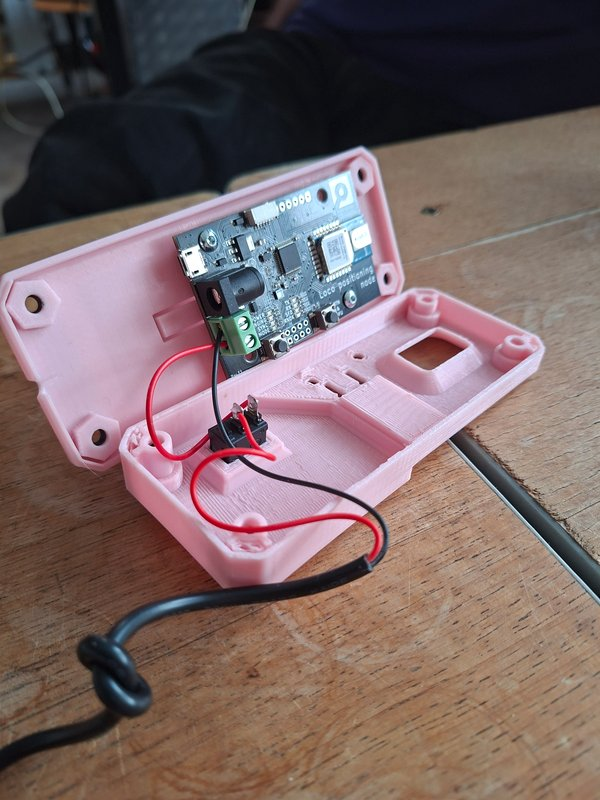

# LPS Node Case and Mounting System

## Overview

- **Files**:
    - [Front.stl](Front.stl)
        - Front shell of the enclosure (contains hole for the UWB)
    - [Back.stl](Back.stl)
        - Back shell of the enclosure (holds the LPS node)
    - [Adapter.stl](Adapter.stl)
        - Adapter for mounting on a pole

## Assembly

- **Parts List**: See the full parts list [here](Parts-List.txt)

| Instructions                                                                                                                                                                                                                                                                                                                                                                                                                        |                                                           |
|-------------------------------------------------------------------------------------------------------------------------------------------------------------------------------------------------------------------------------------------------------------------------------------------------------------------------------------------------------------------------------------------------------------------------------------|-----------------------------------------------------------|
| 1) Place the LPS node into the **back** part of the case. 2) Install the toggle switch and ensure correct orientation.  3) Connect and solder the USB power cable wires. 4) Lay down the USB cable on top of the designated notch in the **back** part (tie a small knot to release the tension). 5) Attach the **front** part and secure it with screws. 6) Use the **adapter** to mount the case on a tripod. |  |

## Credits

*Design by:* [albrecht.mx](https://albrecht.mx)
