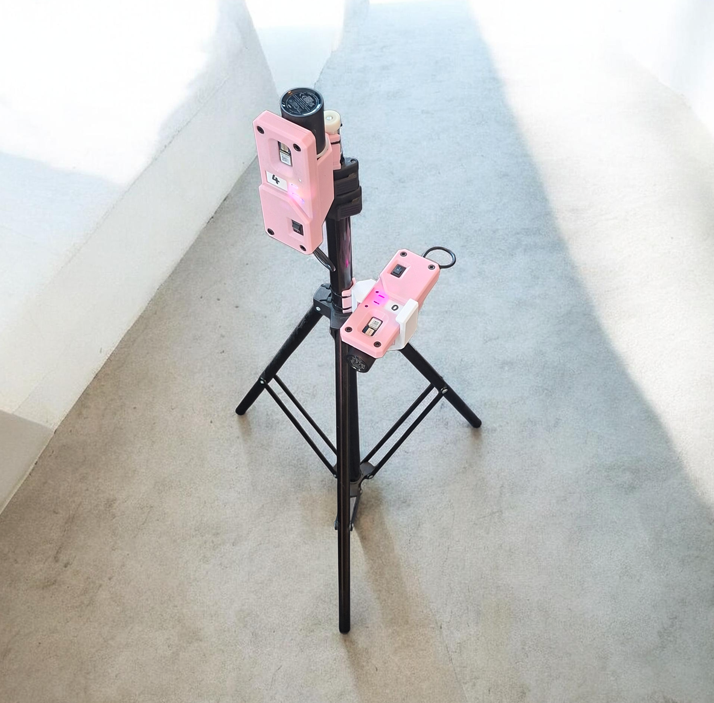

# 3D Printable Case and Mounting System for the LPS Node

## Overview

- **Files**:
    - [Front.stl](Front.stl)
        - Front shell of the enclosure (contains hole for the UWB)
    - [Back.stl](Back.stl)
        - Back shell of the enclosure (holds the LPS node)
    - [Adapter.stl](Adapter.stl)
        - Mounting adapter for poles, lighting stands, tripods, etc.
        - Default orientation: *vertical*
    - [Horizontal-Adapter](Horizontal-Adapter.stl):
        - Used in combination with the Adapter for *horizontal* mounting

## Assembly

- **Parts List**: See the full parts list [here](Parts-List.txt)

| Instructions                                                                                                                                                                                                                                                                                                                                                                                                                        |                                                           |
|-------------------------------------------------------------------------------------------------------------------------------------------------------------------------------------------------------------------------------------------------------------------------------------------------------------------------------------------------------------------------------------------------------------------------------------|-----------------------------------------------------------|
| 1) Place the LPS node into the **back** part of the case. 2) Install the toggle switch and ensure correct orientation.  3) Connect and solder the USB power cable wires. 4) Lay down the USB cable on top of the designated notch in the **back** part (tie a small knot to release the tension). 5) Attach the **front** part and secure it with screws. 6) Use the **adapter** to mount the case on a tripod. |  |

## Mounting Options

The case design supports both horizontal and vertical mounting configurations.

A short usage demonstration is available here: https://www.youtube.com/shorts/OmPvBCfg5j4

## Credits

**Front.stl, Back.stl, Adapter.stl**
Original design by [albrecht.mx](https://albrecht.mx)

**Horizontal Adapter**
Created by Valentine Möbius; edited by Dominik Grzelak
